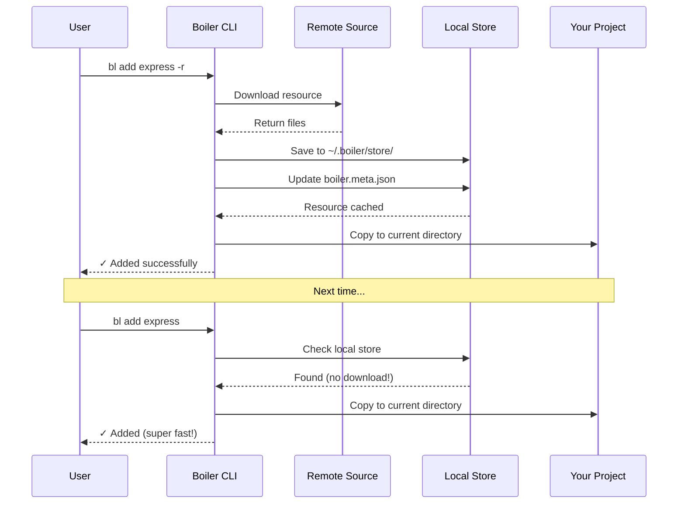
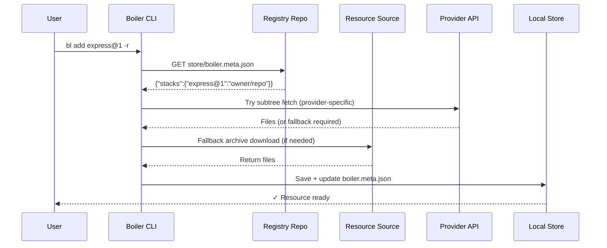

import { Icon } from '@astrojs/starlight/components';

Boiler can fetch resources from **anywhere** - GitHub, GitLab, Bitbucket, your own website, or a direct URL. No lock-in, complete flexibility.

---

## Two Commands for Remote Fetching

<table>
  <thead>
    <tr>
      <th>Command</th>
      <th>Saves to local store?</th>
      <th>Use case</th>
    </tr>
  </thead>
  <tbody>
    <tr>
      <td><code>bl add ... -r</code></td>
      <td>✅ Yes - reusable later with <code>bl add &lt;name&gt;</code></td>
      <td>Team/personal registry, frequently reused resources</td>
    </tr>
    <tr>
      <td><code>bl use ...</code></td>
      <td>❌ No - one-shot fetch</td>
      <td>Grab something once, no clutter</td>
    </tr>
  </tbody>
</table>

---

## Supported Platforms

Boiler auto-detects the right provider from the URL:

<table>
  <thead>
    <tr>
      <th>Platform</th>
      <th>Format</th>
      <th>Archive</th>
    </tr>
  </thead>
  <tbody>
    <tr>
      <td><strong>GitHub</strong></td>
      <td><code>owner/repo</code> or <code>https://github.com/owner/repo</code></td>
      <td>tar.gz</td>
    </tr>
    <tr>
      <td><strong>GitLab</strong></td>
      <td><code>https://gitlab.com/owner/repo</code></td>
      <td>tar.gz</td>
    </tr>
    <tr>
      <td><strong>Bitbucket</strong></td>
      <td><code>https://bitbucket.org/owner/repo</code></td>
      <td>zip</td>
    </tr>
    <tr>
      <td><strong>Custom registry</strong></td>
      <td><code>https://yoursite.com/boiler-store</code></td>
      <td>zip</td>
    </tr>
    <tr>
      <td><strong>Direct archive</strong></td>
      <td><code>https://anysite.com/stack.zip</code> or <code>.tar.gz</code></td>
      <td>auto-detected</td>
    </tr>
  </tbody>
</table>

---

## Understanding Formats

The colon (`:`) separates the **source** from the **path inside it**.

<table>
  <thead>
    <tr>
      <th>What You Want</th>
      <th>Format</th>
      <th>Example</th>
    </tr>
  </thead>
  <tbody>
    <tr>
      <td>Whole GitHub/GitLab/Bitbucket repo</td>
      <td><code>owner/repo</code> or full URL</td>
      <td><code>alice/my-stack</code></td>
    </tr>
    <tr>
      <td>File inside a GitHub repo</td>
      <td><code>owner/repo:path/to/file.js</code></td>
      <td><code>alice/snippets:js/logger.js</code></td>
    </tr>
    <tr>
      <td>Custom domain file</td>
      <td><code>domain.com:path/file</code></td>
      <td><code>mysite.com:snippets/util.js</code></td>
    </tr>
    <tr>
      <td>Direct file URL</td>
      <td><code>https://full-url</code></td>
      <td><code>https://mysite.com/file.js</code></td>
    </tr>
    <tr>
      <td>Direct archive URL</td>
      <td><code>https://full-url.zip</code></td>
      <td><code>https://mysite.com/stack.zip</code></td>
    </tr>
  </tbody>
</table>

---

## `bl add -r` - Fetch and Save

When you use `-r`, Boiler **downloads and caches locally** so you can reuse without re-downloading:

1. Downloads from internet
2. Saves to `~/.boiler/store/`
3. Updates `boiler.meta.json`
4. Copies to your project



### Examples

```bash
# From configured registry
bl add express@1 -r

# GitHub (short format)
bl add rishiyaduwanshi/boiler-express -r

# GitHub (full URL)
bl add https://github.com/alice/my-stack -r

# GitLab
bl add https://gitlab.com/alice/my-stack -r

# Bitbucket
bl add https://bitbucket.org/alice/my-stack -r

# GitHub subfolder as stack
bl add vercel/next.js:examples/blog -r

# GitHub single file (snippet)
bl add rishiyaduwanshi/boiler-snippets:js/errorHandler.js -r

# Direct URL
bl add https://mysite.com/snippets/helper.js -r

# Custom registry (one-time override)
bl add express@1 -r --registry https://github.com/myteam/boiler
```

---

## `bl use` - One-Shot Fetch (No Store)

No `-r` flag, no local caching. Just fetch and use directly.

```bash
# GitHub repo
bl use alice/my-stack

# GitLab
bl use https://gitlab.com/alice/stack

# Bitbucket
bl use https://bitbucket.org/alice/stack

# Direct zip or tar.gz (any site)
bl use https://mysite.com/templates/express.zip
bl use https://mysite.com/stack.tar.gz

# Single file
bl use alice/snippets:js/errorHandler.js
bl use https://mysite.com/snippets/logger.js

# Into a specific folder
bl use alice/my-stack ./new-project
```

---

## Using a Registry

Set once, use forever:

```bash
bl conf --set-registry https://github.com/rishiyaduwanshi/boiler
bl search express -r
bl add express@1 -r
```

One-time override:

```bash
bl add express@1 -r --registry https://github.com/myteam/boiler
```



---

## Setting Up Your Own Registry

Any static file server works (GitHub Pages, Netlify, S3, your own VPS). Required structure:

```
<your-registry-url>/
└── store/
    ├── boiler.meta.json       ← resource index
    ├── stacks/
    │   ├── express.zip
    │   └── nextjs.zip
    └── snippets/
        ├── errorHandler@1.js
        └── logger@1.js
```

This is the **same structure** as the official Boiler registry on GitHub - consistent everywhere.

### boiler.meta.json for GitHub/GitLab/Bitbucket registry

Values are `owner/repo` paths (provider is auto-detected from the configured registry URL):

```json
{
  "stacks": {
    "express@1": "alice/boiler-express"
  },
  "snippets": {
    "errorHandler@1.js": "alice/boiler-snippets:js/errorHandler@1.js"
  }
}
```

### boiler.meta.json for a custom/generic website

Values must be **full download URLs** since the tool cannot infer paths from a custom server:

```json
{
  "stacks": {
    "express@1": "https://mysite.com/store/stacks/express.zip"
  },
  "snippets": {
    "errorHandler@1.js": "https://mysite.com/store/snippets/errorHandler@1.js"
  }
}
```

Then use it:

```bash
bl conf --set-registry https://mysite.com/store
bl add express@1 -r
```

---

**Explore more**

* [bl use command](/commands/bl_use/)
* [bl add command](/commands/bl_add/)
* [Quick Start Guide](/guides/quickstart/)
* [Installation](/guides/installation/)
