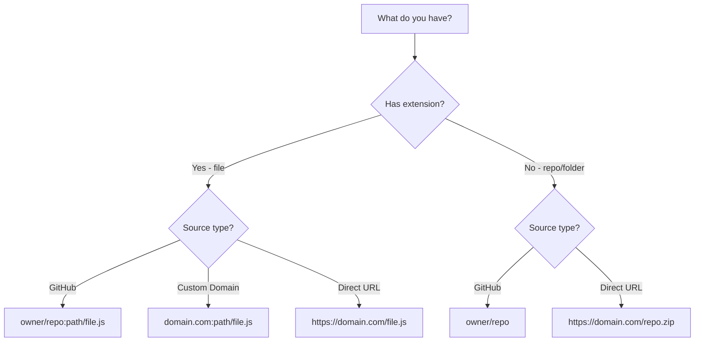
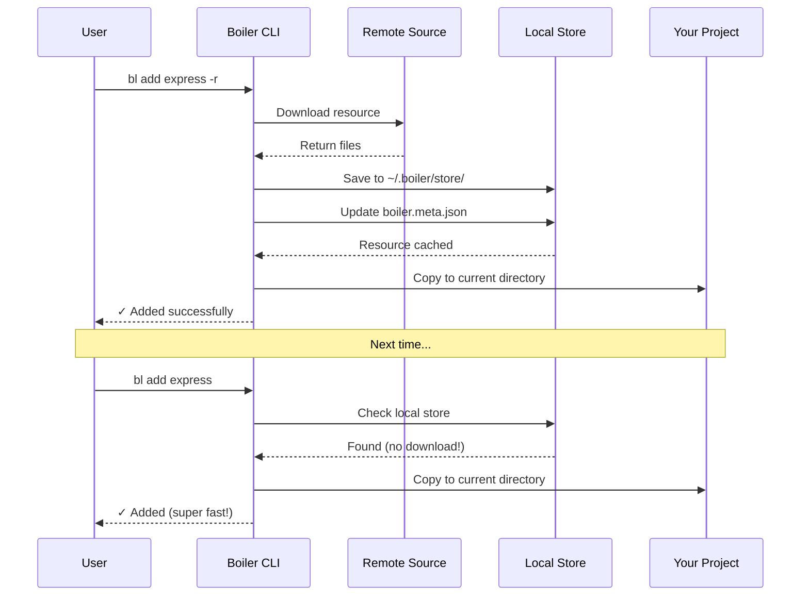
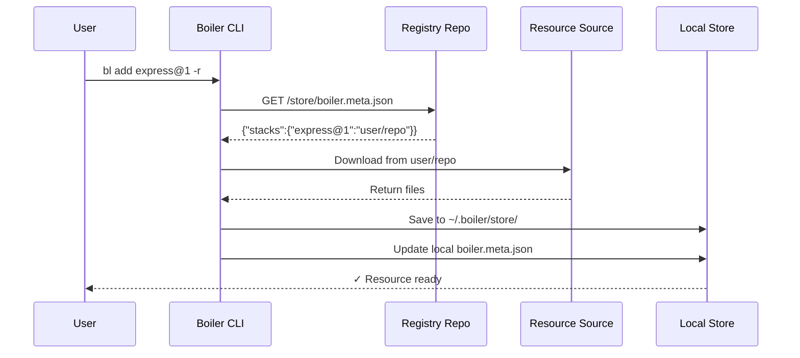

---
title: Remote Fetching
description: Learn how Boiler fetches snippets and stacks from GitHub, registries, custom domains, and direct URLs.
---

import { Icon } from '@astrojs/starlight/components';

Alright, let's talk about one of the coolest features in Boiler - **fetching resources from literally anywhere**!

Whether you want to grab code from GitHub repos, set up your own registry, pull from your personal website, or just download from any public URL - Boiler's got your back. No limitations, complete flexibility.

---

## Quick Overview

Boiler gives you **four different ways** to fetch remote resources. Pick what works best for you:

| Method | Example Command | Use Case |
|--------|----------------|----------|
| **Registry** | `bl add express@1 -r` | Perfect for teams sharing resources |
| **Direct GitHub** | `bl add user/repo -r` | Grab from any public repo |
| **Custom Domain** | `bl add mysite.com:path/file.js -r` | Host on your own website |
| **Direct URL** | `bl add https://example.com/file.js -r` | Maximum flexibility |

```mermaid
graph LR
  A[Boiler CLI] --> B{Choose Method}
  B --> C[Registry]
  B --> D[GitHub]
  B --> E[Custom Domain]
  B --> F[Direct URL]

  C --> G[Fetch from Registry]
  D --> H[Fetch from GitHub]
  E --> I[Fetch from Domain]
  F --> J[Fetch from URL]

  G --> K[Local Store]
  H --> K
  I --> K
  J --> K

  K --> L[Your Project]
````

---

## Understanding Formats

Before we dive deeper, let’s clear up how Boiler interprets different paths.

### When to Use `:` (Colon)

The colon (`:`) separates the **source** from the **path inside it**.

**For GitHub repos:**

```bash
owner/repo:path/to/file.js
# : colon separates repo from internal file path

Example:
rishiyaduwanshi/snippets:js/errorHandler.js
```

**For custom domains:**

```bash
domain.com:path/to/file.js
# : colon separates domain from internal file path

Example:
iamabhinav.dev:snippets/helper.js
```

### When NOT to Use `:` (Colon)

**Entire repos (stacks):**

```bash
owner/repo   # No colon - fetches the whole repo
```

**Direct URLs:**

```bash
https://domain.com/path/file.js   # No extra colon - URL already contains ://
```

### Quick Format Reference

| What You Want      | Format                 | Example                      |
| ------------------ | ---------------------- | ---------------------------- |
| Whole GitHub repo  | `owner/repo`           | `vercel/next.js`             |
| GitHub file        | `owner/repo:path/file` | `user/repo:src/app.js`       |
| Custom domain file | `domain:path/file`     | `mysite.com:code/util.js`    |
| Direct URL         | `https://full-url`     | `https://mysite.com/file.js` |



---


When you use `-r`, Boiler **downloads once and caches locally**:

1. **Downloads from internet**
2. **Saves to** `~/.boiler/store/`
3. **Updates** `boiler.meta.json`
4. **Copies to your project**
5. **Reuses locally next time**

### Example Flow





## Four Ways to Fetch

```bash
# Method 1: Registry
bl conf --set-registry https://github.com/rishiyaduwanshi/boiler
bl add express -r

# Method 2: GitHub
bl add rishiyaduwanshi/boiler-express -r
bl add vercel/next.js:examples/blog -r

# Method 3: Custom Domain
bl add iamabhinav.dev:snippets/helper.js -r

# Method 4: Direct URL
bl add https://iamabhinav.dev/snippets/helper.js -r
```

---

## Fetching from GitHub

### Entire Repo

```bash
bl add rishiyaduwanshi/boiler-express -r
```

### Specific Folder

```bash
bl add vercel/next.js:examples/blog -r
```

### Single File

```bash
bl add rishiyaduwanshi/boiler-snippets:js/errorHandler.js -r
```

---

## Using a Registry

```bash
bl conf
bl conf --set-registry https://github.com/rishiyaduwanshi/boiler
bl search express -r
bl add express@1 -r
```

### One-time Override

```bash
bl search auth -r --registry https://github.com/myteam/boiler
```



---

## Fetching from Custom Websites

### Format

```bash
bl add iamabhinav.dev:snippets/helper.js -r
```

### Website structure example

```
https://iamabhinav.dev/
├── snippets/
│   ├── helper.js
│   ├── validator.js
│   └── errorHandler.js
└── stacks/
    └── express/
```

### Make files accessible at:

`https://yourdomain.com/snippets/helper.js`

---

## Fetching from Direct URLs

Examples:

```bash
bl add https://cdn.jsdelivr.net/gh/user/repo/file.js -r
bl add https://raw.githubusercontent.com/user/repo/main/file.js -r
```

---

## boiler.meta.json Reference

**Location:**

```
store/boiler.meta.json
```

Example:

```json
{
  "stacks": {
    "express@1": "rishiyaduwanshi/boiler-express"
  },
  "snippets": {
    "errorHandler@1.js": "rishiyaduwanshi/snippets:js/errorHandler.js"
  }
}
```

---
**Explore more**

* [Commands Reference](../commands/bl.md)
* [Quick Start Guide](./quickstart.md)
* [Installation](./installation.mdx)


